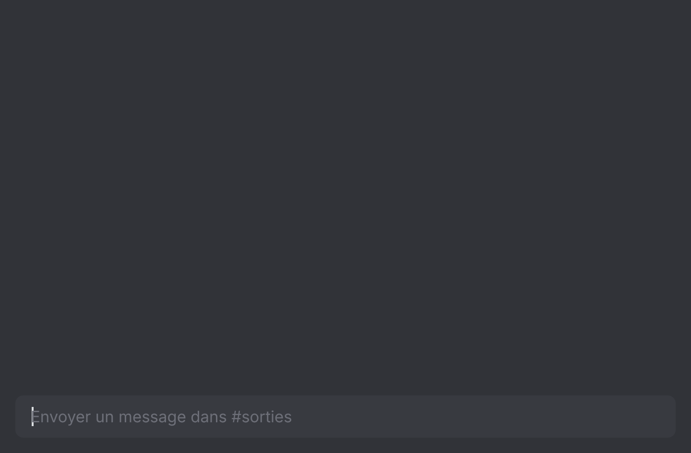
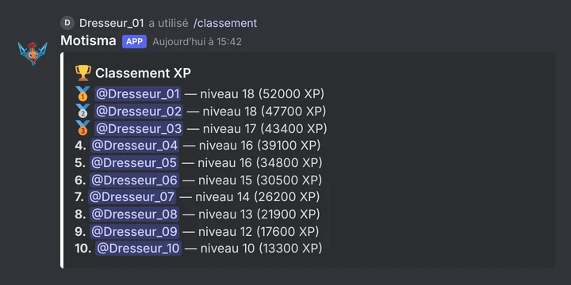
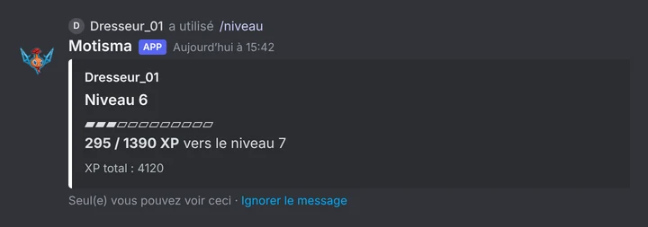

# Motisma

Motisma is the Discord bot of the Pokémon GO community in Pau, France.

[](LICENSE)
[](.nvmrc)

[Version française](README.md)

New members land with a "pending" role and post a screenshot of their Pokémon GO profile. A moderator approves them with a reaction, and the bot sets their nickname and posts a welcome message. To plan a meetup, `/rdv` opens a private channel that people join with a button; it goes away at midnight (Paris time) the next day. Chatting earns XP, and there is a Pokémon GO leaderboard that players update by sending a screenshot. On top of that: a few games, polls, and posts for new videos from a YouTube channel.

The bot never asks for anyone's location. From screenshots, only the stats it reads are saved to the database, never the image. Reading them goes through the Gemini API, and only when a key is set.

The bot itself speaks French, so commands and messages below are in French.

## Preview

These previews are rebuilt from the bot's real messages with made-up data. They are not Discord screenshots.



The announcement `/rdv` posts in the meetups channel.



`/classement`: the top 10 members by XP.



`/niveau`: only the person who asked can see the reply.

## Commands

| Command | What it does | Who |
|---|---|---|
| `/rdv` | Creates a temporary channel for a meetup (45 minutes by default) | Everyone |
| `/rdv-modifier` | Changes the place, time, duration or description of an open meetup | The organizer, or "Manage Channels" |
| `/set-pogo` | Saves your trainer name and friend code | Everyone |
| `/classement-pogo` | `voir` the leaderboard (level, XP, Pokémon caught, distance, PokéStops, eggs), `rejoindre` or `quitter` it | Everyone |
| `/niveau`, `/classement` | Your level and XP; the server's top 10 | Everyone |
| `/quiz`, `/pendu`, `/morpion`, `/devinette` | Who's that Pokémon, hangman, tic-tac-toe, higher or lower | Everyone |
| `/sondage` | Reaction poll, up to 10 choices (Yes / No if none are given) | Everyone |
| `/help`, `/userinfo`, `/avatar` | Help, member profile, avatar | Everyone |
| `/clear` | Deletes 1 to 100 recent messages | "Manage Messages" |
| "Déplacer" menu on a message | Moves a message to another channel or a forum post | "Manage Messages" |
| `/embed`, `/say`, `/bingo` | Posts an info embed, makes the bot talk, posts a bingo image | "Manage Server" |
| `/reset-joueur` | Wipes all or part of a player's data | "Manage Server" |
| `/test`, `/test-log` | Simulate a new member and show a sample log | "Manage Server" |

## Setup

1. You need Node.js 22, a PostgreSQL database, and a bot created on the [Discord developer portal](https://discord.com/developers/applications) with the **Server Members** privileged intent. If you set a Gemini key, turn on **Message Content** too.
2. Copy `.env.example` to `.env` and fill it in (see below).
3. `npm install`
4. `npm run deploy` registers the slash commands on the server. Run it again whenever a command changes.
5. `npm start`

With Docker, replace the last step with `docker compose up -d --build`. The `docker-compose.yml` only runs the bot: it joins an external Docker network called `mewnivers` and expects a PostgreSQL database named `db` on it (user and database `rotom`, password `POSTGRES_PASSWORD`).

## Configuration

Everything lives in `.env`, which must never be committed. Four values matter to get started:

| Variable | Purpose |
|---|---|
| `DISCORD_TOKEN` | Bot token |
| `CLIENT_ID` | Application ID, used by `npm run deploy` |
| `GUILD_ID` | Server ID |
| `DATABASE_URL` | PostgreSQL connection outside Docker. With Compose, it is built from `POSTGRES_PASSWORD` |

Without `DATABASE_URL` the bot still starts, but Pokémon GO profiles are off. Roles, channels and options (Gemini, YouTube, levels, status) are all described in [`.env.example`](.env.example), which is the reference.

## Development and license

```bash
npm run check   # syntax of src/ and scripts/
npm test
```

Both also run in CI on every pull request. To contribute, read [CONTRIBUTING.md](CONTRIBUTING.md); to report a vulnerability, see [SECURITY.md](SECURITY.md). Technical docs (database, embeds) are in [docs/](docs/README.md).

[MIT](LICENSE) license. A fan project, not affiliated with Niantic or The Pokémon Company.
