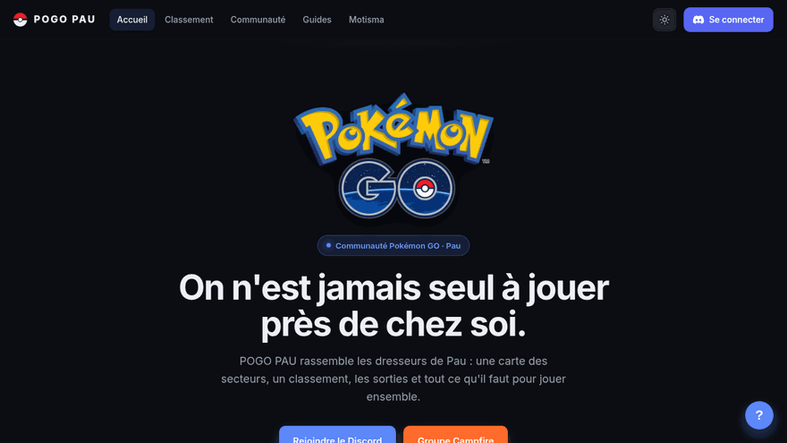
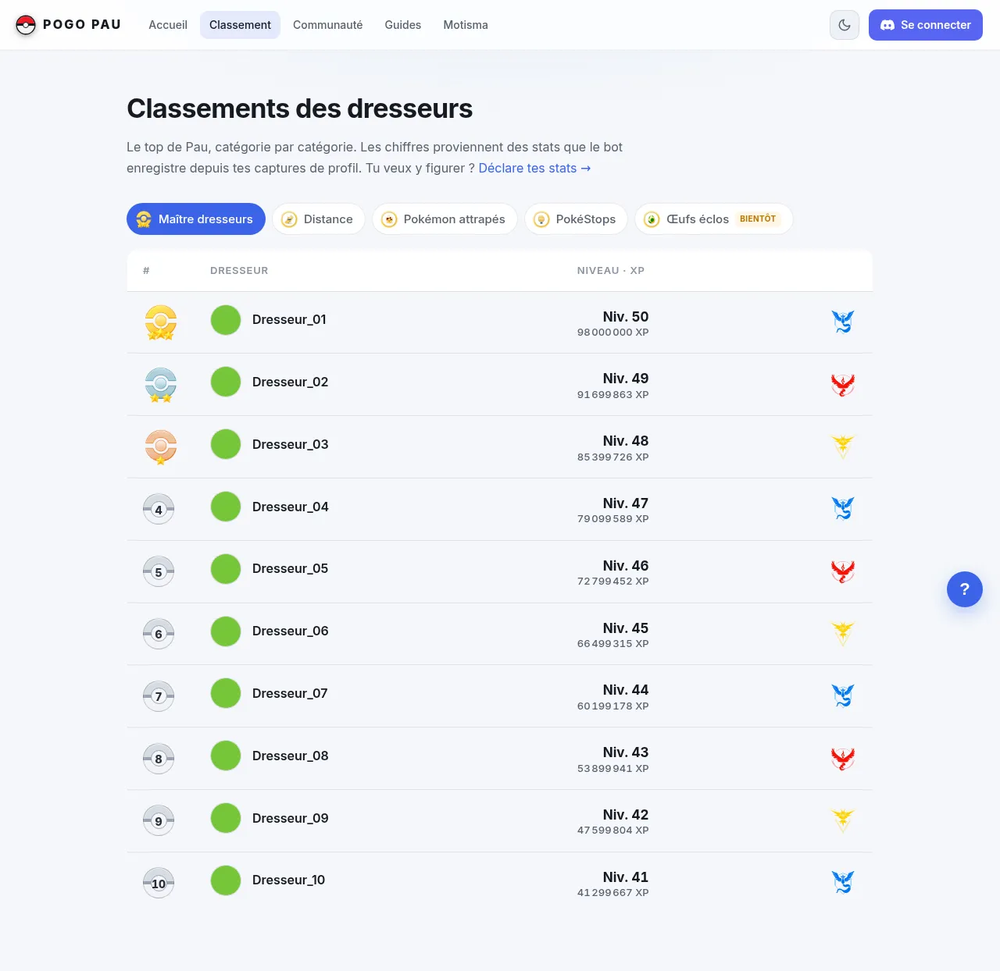
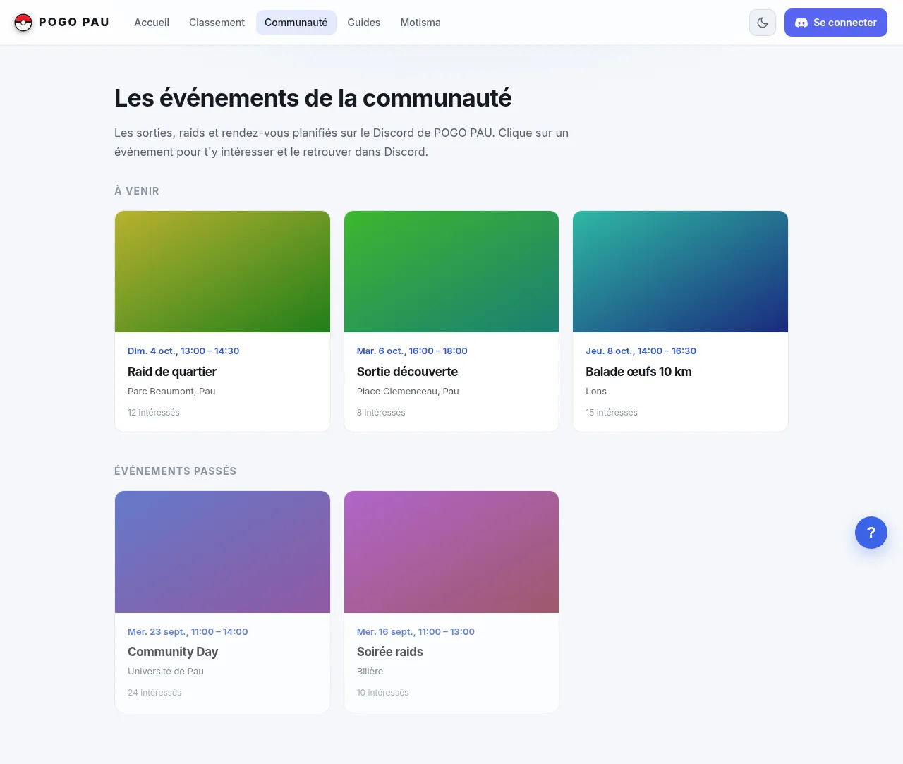

<div align="center">


# Motisma'Pau

**The Discord bot and website of the Pokémon GO community of Pau, France.**

[](LICENSE)
[](https://nodejs.org/)
[](https://discord.js.org/)
[](https://www.postgresql.org/)
[](docker-compose.yml)



[Version française](README.md)

</div>

---

> ⚠️ **Project status.** The bot, the API and the website work together. The site's "Map" page is currently hidden (the `/carte` route redirects to the home page). The map is still available in Discord through `/map`.

## What it does

Motisma'Pau has two goals: show every player they are not alone in their area, and make outings easy to organize, without ever exposing personal information.

1. **Welcome.** A newcomer gets a "pending" role and posts profile screenshots. A moderator validates with one click. The nickname and profile are updated, then a welcome message is sent.
2. **Organize.** `/rdv` opens a temporary channel for an outing (place, time, duration). Members sign up with a button. The channel closes by itself.
3. **Count.** `/map` shows the number of players per area of Pau, based on the roles players give themselves.
4. **Rank.** Each player declares their stats (level, XP, Pokédex…). The leaderboard is available on Discord and on the website.
5. **Entertain.** Message-based levels, temporary voice channels, games, polls, YouTube announcements.

## Preview

Home and Community: screenshots of the live site. Leaderboard and bot map: demo data ("Dresseur_01"… players), so no real members are exposed. The site's `/carte` page is hidden: the map below comes from the bot.

### `/map` map (Discord)

The image generated by the `/map` command: one counter per area of Pau.


*Demo counters. An area only shows its counter from 3 players.*

### Home

Community presentation, with links to Discord and Campfire.

<picture>
  <source media="(prefers-color-scheme: dark)" srcset="docs/assets/readme/accueil-dark.webp">
  
</picture>

### Leaderboard

Trainers ranked category by category (here, the "Maître dresseurs" tab).

<picture>
  <source media="(prefers-color-scheme: dark)" srcset="docs/assets/readme/classement-dark.webp">
  
</picture>

### Community

The community's upcoming and past outings.

<picture>
  <source media="(prefers-color-scheme: dark)" srcset="docs/assets/readme/communaute-dark.webp">
  
</picture>

## Architecture

<div align="center">

</div>

The bot and the API share the same PostgreSQL database. The API only listens locally (`127.0.0.1:3100`): only nginx relays it, under `/api/`. The database has no published port.

| Folder | Role | Stack |
|---|---|---|
| `src/` | Discord bot: commands (`commands/`) and features (`features/`) | Node.js, discord.js 14 |
| `server/` | API: Discord login, leaderboard, dashboard | Fastify 5, PostgreSQL |
| `web/` | Public website and dashboard | React 18, Vite, MapLibre GL |
| `deploy/` | VPS install: script, nginx vhost, guide | Bash, nginx, certbot |
| `assets/` | Area geometry, sample profile image | GeoJSON, PNG |

## Bot features

| Module | What it does |
|---|---|
| `verification` | "Pending" role, screenshot reading, validation by a moderator's reaction |
| `visionExtract` | Reads a profile screenshot with the Gemini API to detect the trainer name and friend code. Optional: without a key, the module stays dormant |
| `welcome` | Random welcome message on validation |
| `teamRole` | Detects the team (Mystic, Valor, Instinct) from the screenshot and assigns the role |
| `rdv*` | Outings: temporary channel, sign-ups, edits, automatic closing |
| `classement` | Monthly stats leaderboard, DM reminder, staff alert when a screenshot looks edited |
| `leveling` | XP per message (15 to 25, at most once a minute per member), levels, reward roles |
| `tempVoice` | "Join to create" voice channel, deleted once empty |
| `languageWatch` | Replies to swear words, with a few seconds of timeout |
| `youtube` | Announces a channel's new videos, no API key needed |
| `forumHeart` | Reacts with ❤️ to images posted in a forum |
| `forumKeepAlive` | Unarchives forum posts so their mentions stay readable |

The bot's messages and command descriptions are in French.

## Commands

| Command | Description |
|---|---|
| `/help` | Help and command list |
| `/rdv` | Create an outing (place, time, duration, description) |
| `/rdv-modifier` | Edit an outing that is already open |
| `/set-pogo` | Save your in-game name and friend code |
| `/userinfo` | Show a member's profile |
| `/niveau` | Show your level and XP |
| `/classement` | Top 10 members by XP |
| `/classement-pogo voir` | Pokémon GO leaderboard (level, XP, Pokédex) |
| `/classement-pogo rejoindre` | Join the leaderboard, with a monthly reminder |
| `/avatar` | Show a member's avatar |
| `/sondage` | Create a poll with reactions |
| `/quiz`, `/pendu`, `/morpion`, `/devinette` | Games: "Who's that Pokémon?", hangman, tic-tac-toe, higher or lower |

Staff-only commands:

| Command | Description |
|---|---|
| `/map` | Players per area, as a PNG image ("Manage Server" permission) |
| `/clear` | Delete recent messages |
| `/embed` | Publish or update an information embed |
| `/say` | Make the bot speak in a channel |
| `/bingo` | Publish or update a bingo image |
| `/reset-joueur` | Reset a player's data |
| `/test`, `/test-log` | Simulate a member joining and preview a log example |
| "Déplacer" context menu | Move a message to another channel |

## Website

| Page | Route | Content |
|---|---|---|
| Home | `/` | Community presentation, Discord and Campfire links |
| Leaderboard | `/classement` | Trainer rankings, category by category |
| Community | `/communaute` | Upcoming and past events |
| Guides | `/guides` | Local guides |
| Motisma | `/motisma` | Bot presentation, getting started, command list |
| Profile | `/profil` | Discord login, stats declaration |
| Dashboard | `/dashboard` | Bot configuration and messages (admins only) |
| Terms, privacy | `/terms`, `/privacy` | Legal pages |

The `/carte` page (MapLibre map of the areas, with counters and spots) exists in the code but stays hidden. The site is in French.

## Privacy

- No geolocation, no address, no individual position.
- The area is **declarative and voluntary**: players pick their own area role.
- The map only shows totals per area. An area only shows its counter from **3 players** (`MIN_VISIBLE_PLAYERS`), so no isolated player can be identified.
- If the Gemini key is configured, profile screenshots are sent to the Gemini API to be read. Without a key, nothing is sent.

## Installation

Requirements: Docker with Compose, and a bot created in the [Discord developer portal](https://discord.com/developers/applications) with the **Server Members** and **Message Content** privileged intents enabled.

```bash
git clone <repository-url> Motisma
cd Motisma
cp .env.example .env       # then fill in at least DISCORD_TOKEN, CLIENT_ID, GUILD_ID, POSTGRES_PASSWORD
docker compose up -d --build
```

Slash commands are registered once, then again whenever a command changes:

```bash
npm install
npm run deploy
```

`docker compose` starts three services: `db` (PostgreSQL 16), `bot` and `api`.

To install the website on a VPS (build, nginx, HTTPS), follow [`deploy/INSTALL.md`](deploy/INSTALL.md) (in French) or run `sudo bash deploy/install.sh --help`.

## Configuration

All configuration goes through the `.env` file (template: `.env.example`). Never commit it.

**Discord and database**

| Variable | Purpose |
|---|---|
| `DISCORD_TOKEN` | Bot token |
| `CLIENT_ID` | Application ID, needed to register commands |
| `GUILD_ID` | Discord server ID |
| `POSTGRES_PASSWORD` | PostgreSQL container password |
| `DATABASE_URL` | Connection string. Injected by Compose; set it only outside Docker |

**Roles and channels**

| Variable | Purpose |
|---|---|
| `VERIFICATION_ROLE_ID` | "Pending" role given to newcomers |
| `MEMBER_ROLE_ID` | Member role given on validation |
| `VERIFICATION_CHANNEL_ID` | Restricts verification to a single channel |
| `TEMP_VOICE_HUB_ID` | "Join to create" voice channel |
| `TEMP_VOICE_CATEGORY_ID` | Category for temporary voice channels |
| `RDV_CATEGORY_ID` | Category for `/rdv` outing channels |
| `RDV_ANNOUNCE_CHANNEL_ID` | Channel where `/rdv` announces outings |
| `WELCOME_CHANNEL_ID` | Welcome message channel |
| `LOG_CHANNEL_ID` | Staff log channel |
| `AMBASSADOR_ROLE_ID` | Role listed as ambassador in the presentation embed |
| `TEAM_ROLE_MYSTIC`, `TEAM_ROLE_VALOR`, `TEAM_ROLE_INSTINCT` | Roles for the three teams, assigned automatically |

**Optional features**

| Variable | Purpose |
|---|---|
| `GEMINI_API_KEY` | Gemini key to read profile screenshots. Empty: disabled |
| `VISION_MODEL` | Vision model (default `gemini-2.5-flash`) |
| `LEVELUP_CHANNEL_ID` | Level-up announcement channel |
| `LEVEL_ROLES` | Reward roles per level, formatted as `10:roleId,20:roleId` |
| `FORUM_HEART_CHANNEL_ID` | Forum where the bot reacts with ❤️ |
| `FORUM_KEEPALIVE_IDS` | Forum posts to unarchive regularly |
| `CLASSEMENT_ROLE_ID` | Role synced with leaderboard participation |
| `CLASSEMENT_REMINDER_DAY`, `CLASSEMENT_REMINDER_HOUR` | Day (1 to 28) and hour of the monthly reminder |
| `CLASSEMENT_ADMIN_CHANNEL_ID` | Staff channel alerted when a screenshot looks edited |
| `LANGUAGE_TIMEOUT_MILD`, `LANGUAGE_TIMEOUT_STRONG` | Timeout length (seconds, 0 to disable) |
| `PRESENCE_TEXT`, `PRESENCE_EMOJI`, `PRESENCE_GAME`, `PRESENCE_GAME_TYPE`, `PRESENCE_STATUS` | Status and activity shown by the bot |

**Web API**

| Variable | Purpose |
|---|---|
| `PORT` | API port (3100 by default) |
| `WEB_ORIGIN` | Public address of the site, used after Discord login |
| `OAUTH_REDIRECT_URI` | OAuth2 redirect URI, identical to the one registered in the Discord portal |
| `DISCORD_CLIENT_SECRET` | OAuth2 secret, server side only |
| `SESSION_SECRET` | Secret used to sign session cookies (`openssl rand -hex 32`) |
| `COOKIE_SECURE` | `true` in production (HTTPS) |
| `ADMIN_DISCORD_IDS` | Discord IDs allowed to validate stats and use the dashboard |

## Development

```bash
# Bot (needs a PostgreSQL database and DATABASE_URL)
npm install
npm start

# API
cd server && npm install && npm run dev

# Website (proxies /api to localhost:3100)
cd web && npm install && npm run dev      # http://localhost:5173
```

The `/map` areas are defined in `src/config/sectors.js` (one Discord role per area); the geometry lives in `assets/sectors.geojson`.

## License

Released under the [MIT](LICENSE) license.

---

Community project, not affiliated with Niantic or The Pokémon Company. Pokémon is a trademark of Nintendo, Creatures Inc. and GAME FREAK inc.
