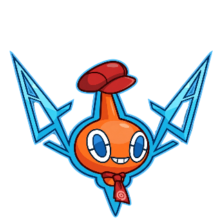
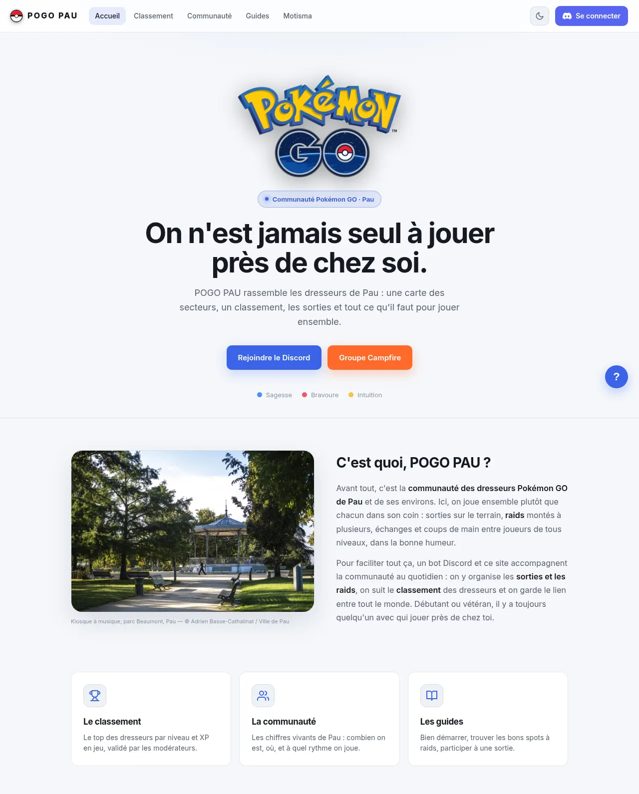
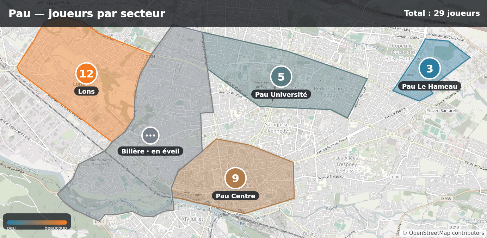
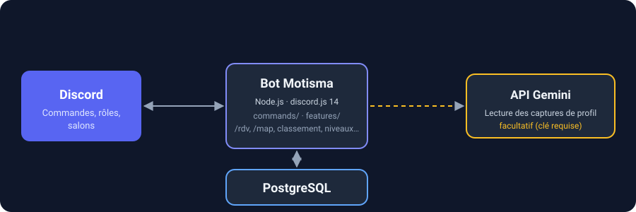

<div align="center">



# Motisma'Pau

**The Discord bot of the Pokémon GO community of Pau, France.**

[](LICENSE)
[](https://nodejs.org/)
[](https://discord.js.org/)
[](https://www.postgresql.org/)
[](docker-compose.yml)


<picture>
  <source media="(prefers-color-scheme: dark)" srcset="docs/assets/readme/accueil-dark.webp">
  
</picture>

<sub>The community website (separate repository).</sub>

[Version française](README.md)

</div>

---

> **This repository holds the bot only.** The website and the API (Discord login, online leaderboard) live in a separate, private repository: PoGo-Pau. Both projects share the same PostgreSQL database.

## What it does

Motisma'Pau has two goals: show every player they are not alone, and make meetups easier, without ever exposing personal information.

1. **Welcome.** A newcomer gets a "pending" role and posts their profile screenshots. A moderator approves with one click. The nickname and profile are updated, then a welcome message is sent.
2. **Organize.** `/rdv` opens a temporary channel for a meetup (place, time, duration). Members sign up with a button. The channel closes by itself.
3. **Count.** `/map` shows the number of players per area of Pau, based on the roles players give themselves.
4. **Rank.** Each player declares their stats (level, XP, Pokédex…). `/classement-pogo` shows the community leaderboard.
5. **Entertain.** Levels per message, temporary voice channels, games, polls, YouTube announcements.

If a Gemini key is configured, the bot also reads profile screenshots to detect the trainer name. Without a key, this reading stays off.

## Preview

The image produced by `/map`: one counter per area of Pau.



*Demo counters. An area only shows its counter from 3 players.*

## Architecture

<div align="center">

</div>

The bot talks to Discord and reads or writes in PostgreSQL (tables are created at startup if missing). The website and API, in the PoGo-Pau repository, use the same database. That repository is the one that starts it.

| Folder | Role | Stack |
|---|---|---|
| `src/` | Discord bot: commands (`commands/`) and features (`features/`) | Node.js, discord.js 14 |
| `scripts/` | Development scripts (map preview, `/rdv` test) | Node.js |
| `assets/` | Area geometry, sample profile image | GeoJSON, PNG |
| `Dockerfile`, `docker-compose.yml` | Bot image and service | Docker, Compose |

## Features

| Module | What it does |
|---|---|
| `verification` | "Pending" role, screenshot reading, approval by a moderator's reaction |
| `visionExtract` | Reads a profile screenshot with the Gemini API to detect the trainer name. Optional: without a key, the module stays inactive |
| `welcome` | Welcome message on approval |
| `teamRole` | Detects the team (Mystic, Valor, Instinct) from the screenshot and assigns the role |
| `rdv*` | Meetups: temporary channel, sign-ups, editing, automatic closing |
| `classement` | Monthly stats leaderboard, reminder by direct message, staff alert if a screenshot looks edited |
| `leveling` | XP per message (15 to 25, at most once a minute per member), levels, reward roles |
| `tempVoice` | "Join to create" voice channel, deleted when empty |
| `languageWatch` | Reply to swearing, with a short timeout of a few seconds |
| `youtube` | Announces a channel's new videos |
| `forumHeart` | Reacts with ❤️ to images posted in a forum |
| `forumKeepAlive` | Unarchives forum posts so their mentions stay readable |
| `helpControls`, `moveControls` | Buttons for `/help` and the "Déplacer" (move) menu |

## Commands

| Command | Description |
|---|---|
| `/help` | Help and command list |
| `/rdv` | Creates a temporary channel for a meetup (place, time, duration, description) |
| `/rdv-modifier` | Edits a meetup that is already open |
| `/set-pogo` | Saves your in-game name and friend code |
| `/userinfo` | Shows a member's profile |
| `/niveau` | Shows your level and XP |
| `/classement` | Top 10 members by XP |
| `/classement-pogo voir` | Pokémon GO leaderboard (level, XP, Pokédex) |
| `/classement-pogo rejoindre`, `/classement-pogo quitter` | Join or leave the leaderboard (monthly reminder) |
| `/avatar` | Shows a member's or a bot's avatar |
| `/sondage` | Creates a poll with reactions |
| `/quiz`, `/pendu`, `/morpion`, `/devinette` | Games: "Who's that Pokémon?", hangman, tic-tac-toe, higher or lower |

Staff-only commands:

| Command | Description |
|---|---|
| `/map` | Players per area, as a PNG image ("Manage Server" permission) |
| `/clear` | Deletes recent messages ("Manage Messages" permission) |
| `/embed` | Publishes or updates an information embed |
| `/say` | Makes the bot speak in a channel |
| `/bingo create`, `/bingo update` | Publishes or updates a bingo image |
| `/reset-joueur` | Resets a player's data |
| `/test`, `/test-log` | Simulate a member joining and show a sample log |
| "Déplacer" context menu | Moves a message to another channel |

## Privacy

- No geolocation, no address, no individual position.
- The area is **self-declared and voluntary**: players pick their own area role.
- The map only shows totals per area. An area only shows its counter from **3 players** (`MIN_VISIBLE_PLAYERS`), so no isolated player can be identified.
- If the Gemini key is configured, profile screenshots are sent to the Gemini API to be read. Without a key, nothing is sent.

## Installation

Requirements: Docker with Compose, Node.js 18 or later, and a bot created in the [Discord developer portal](https://discord.com/developers/applications) with the **Server Members** and **Message Content** privileged intents enabled.

**The database is not in this repository.** `docker-compose.yml` only starts the `bot` service. It attaches it to an external Docker network named `mewnivers` and expects a database reachable at `db:5432` (user `rotom`, database `rotom`). That network and database are created by the PoGo-Pau repository's `docker-compose`, so start that stack first. `POSTGRES_PASSWORD` must have the same value in both repositories.

```bash
git clone <repository-url> Motisma
cd Motisma
cp .env.example .env       # then fill in at least DISCORD_TOKEN, CLIENT_ID, GUILD_ID, POSTGRES_PASSWORD
docker compose up -d --build
```

Slash commands are registered once, then again whenever a command changes:

```bash
npm install
npm run deploy
```

**Without PoGo-Pau (bot only).** You need your own PostgreSQL database. Two options, inferred from the compose file and `.env.example` (unverified: these commands were not run):

- Outside Docker: set `DATABASE_URL` in `.env` to your database, then run `npm start`. Tables are created at startup.
- With Compose: create the network (`docker network create mewnivers`) and start a PostgreSQL container named `db` on it, with user `rotom`, database `rotom` and the password from `POSTGRES_PASSWORD`. Then run `docker compose up -d --build`.

Without `DATABASE_URL`, the bot starts but Pokémon GO profiles are disabled.

## Configuration

All configuration goes through the `.env` file (template: `.env.example`). Never commit it.

**Discord and database**

| Variable | Purpose |
|---|---|
| `DISCORD_TOKEN` | Bot token |
| `CLIENT_ID` | Application ID, needed to register commands |
| `GUILD_ID` | Discord server ID |
| `POSTGRES_PASSWORD` | Password of the PostgreSQL database started by PoGo-Pau, identical on both sides |
| `DATABASE_URL` | Connection string. Injected by Compose; only set it outside Docker |

**Roles and channels**

| Variable | Purpose |
|---|---|
| `VERIFICATION_ROLE_ID` | "Pending" role given to newcomers |
| `MEMBER_ROLE_ID` | Member role given on approval |
| `VERIFICATION_CHANNEL_ID` | Restricts verification to a single channel |
| `TEMP_VOICE_HUB_ID` | "Join to create" voice channel |
| `TEMP_VOICE_CATEGORY_ID` | Category of temporary voice channels |
| `RDV_CATEGORY_ID` | Category of `/rdv` meetup channels |
| `RDV_ANNOUNCE_CHANNEL_ID` | Channel where `/rdv` announces meetups |
| `WELCOME_CHANNEL_ID` | Welcome message channel |
| `LOG_CHANNEL_ID` | Staff log channel |
| `AMBASSADOR_ROLE_ID` | Role listed as ambassador in the presentation embed |
| `TEAM_ROLE_MYSTIC`, `TEAM_ROLE_VALOR`, `TEAM_ROLE_INSTINCT` | Roles of the three teams, assigned automatically |

**Optional features**

| Variable | Purpose |
|---|---|
| `GEMINI_API_KEY` | Gemini key to read profile screenshots. Empty: disabled |
| `VISION_MODEL` | Vision model (default `gemini-2.5-flash`) |
| `LEVELUP_CHANNEL_ID` | Level-up announcement channel |
| `LEVEL_ROLES` | Reward roles per level, formatted as `10:roleId,20:roleId` |
| `FORUM_HEART_CHANNEL_ID` | Forum where the bot reacts with ❤️ |
| `FORUM_KEEPALIVE_IDS` | Forum posts to unarchive regularly |
| `CLASSEMENT_ROLE_ID` | Role synced with leaderboard participation |
| `CLASSEMENT_REMINDER_DAY`, `CLASSEMENT_REMINDER_HOUR` | Day (1 to 28) and hour of the monthly reminder |
| `CLASSEMENT_ADMIN_CHANNEL_ID` | Staff channel alerted when a screenshot looks edited |
| `LANGUAGE_TIMEOUT_MILD`, `LANGUAGE_TIMEOUT_STRONG` | Timeout length (seconds, 0 to disable) |
| `PRESENCE_TEXT`, `PRESENCE_EMOJI`, `PRESENCE_GAME`, `PRESENCE_GAME_TYPE`, `PRESENCE_STATUS` | Status and activity shown by the bot |

## Development

```bash
# Needs a PostgreSQL database and DATABASE_URL in .env
npm install
npm start
```

The `/map` areas are defined in `src/config/sectors.js` (one Discord role per area); the geometry is in `assets/sectors.geojson`.

`package.json` defines neither tests nor lint. See also [`CONTRIBUTING.md`](CONTRIBUTING.md).

## License

Released under the [MIT](LICENSE) license.

---

Community project, not affiliated with Niantic or The Pokémon Company. Pokémon is a trademark of Nintendo, Creatures Inc. and GAME FREAK inc.
