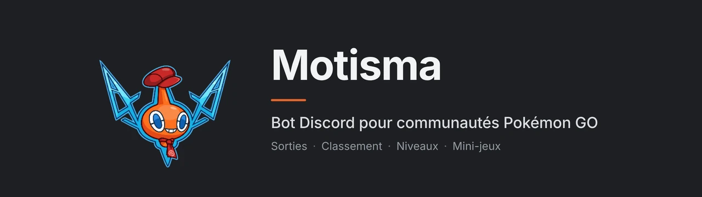
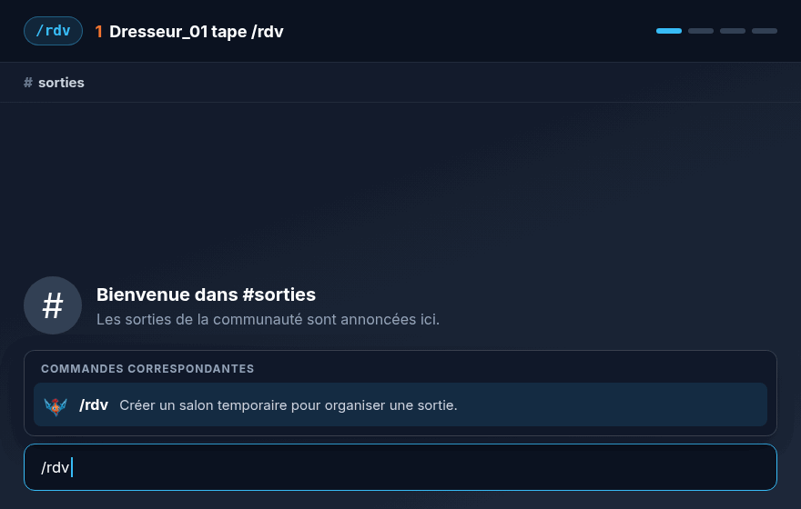
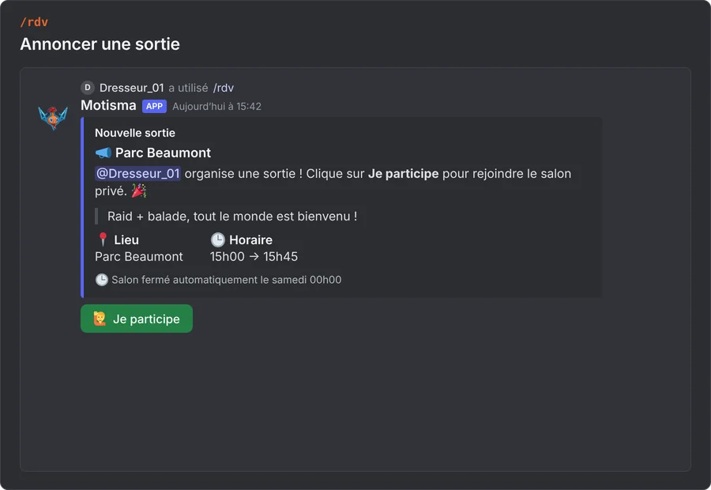
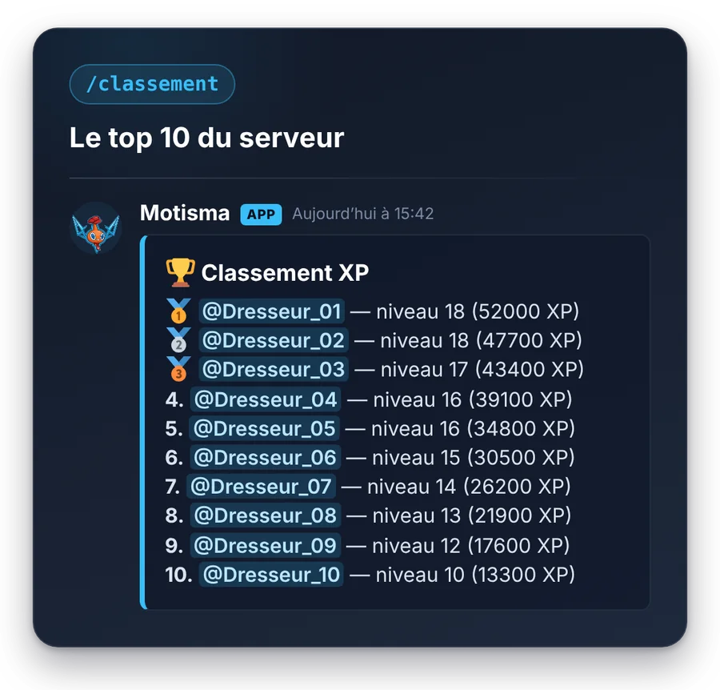
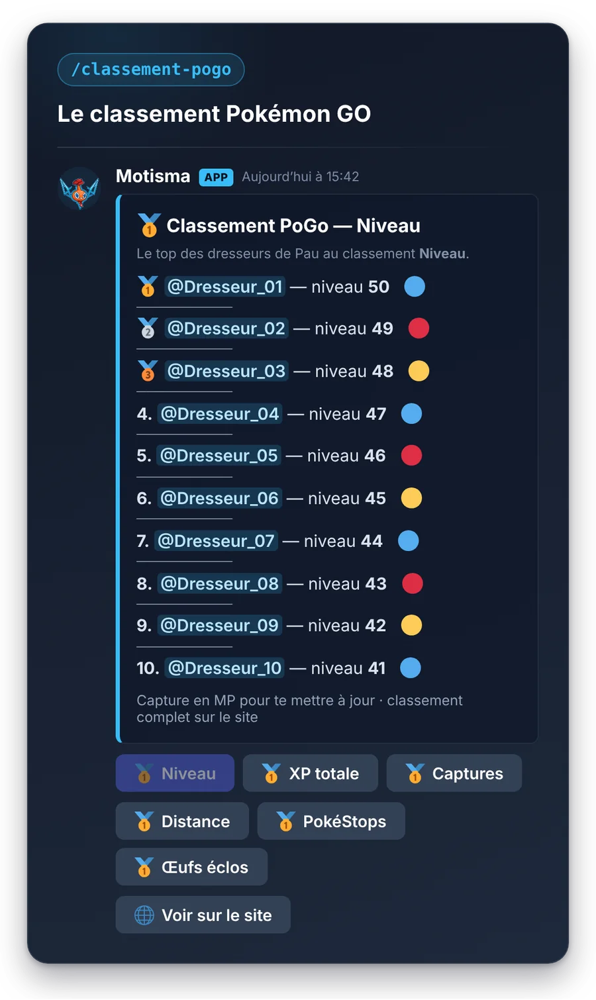
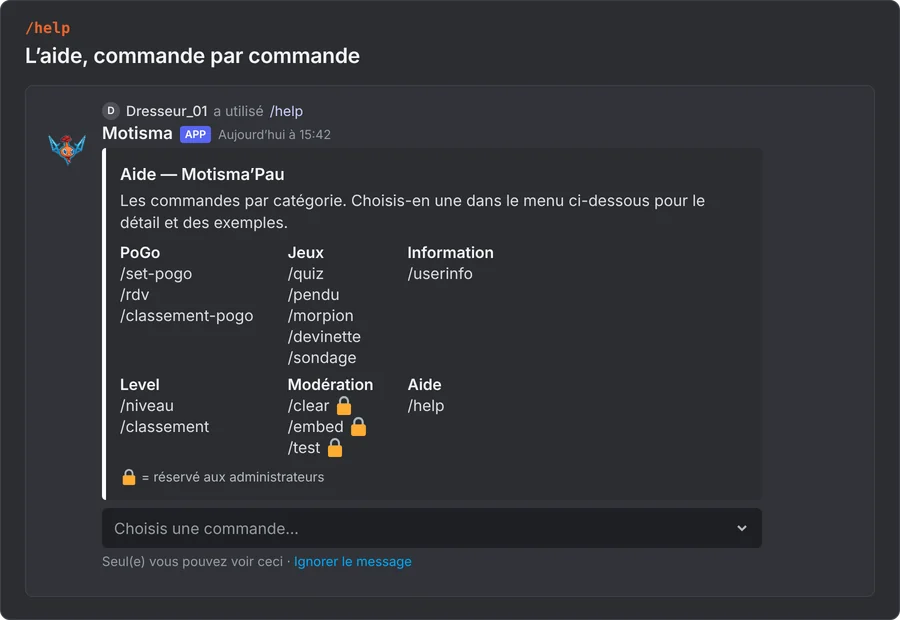
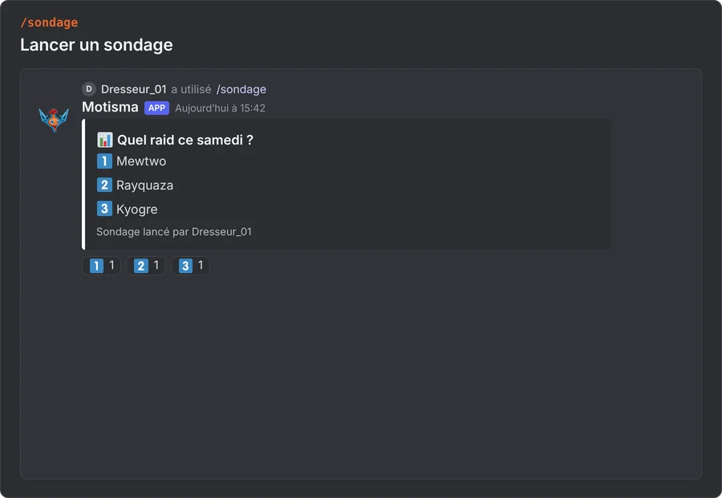
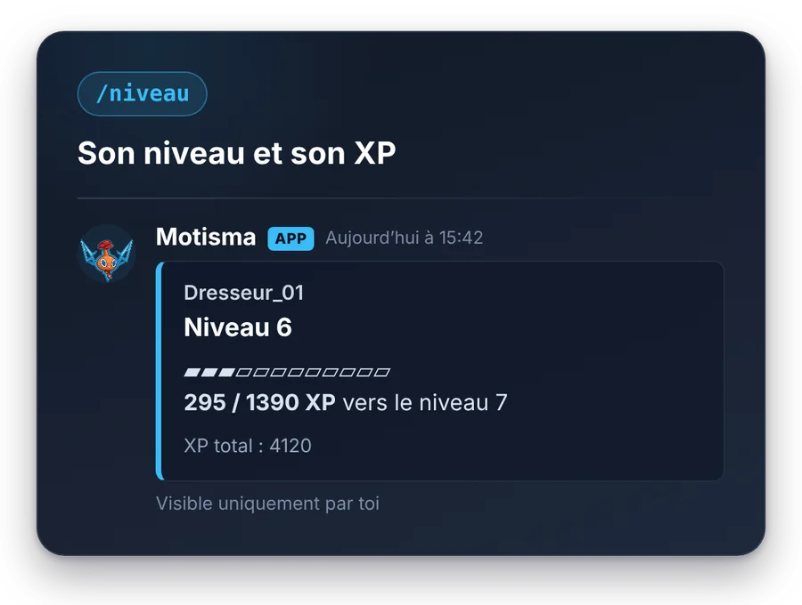
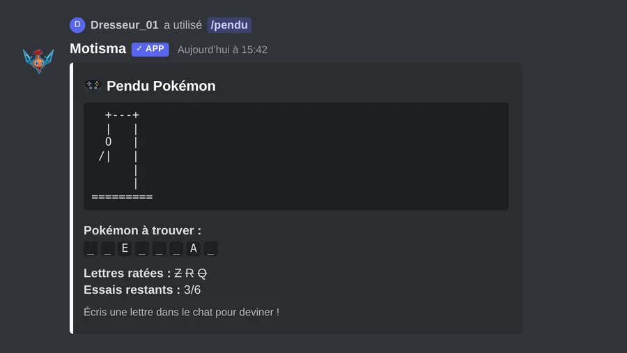
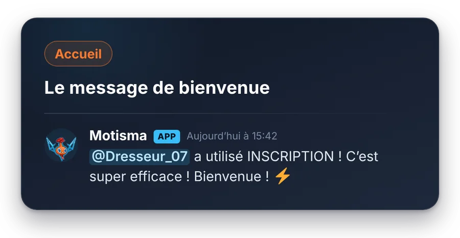

<div align="center">

**[Aperçu](#apercu)** · **[Commandes](#commandes)** · **[Installation](#installation)** · **[Configuration](#configuration)**

[](LICENSE)
[](https://nodejs.org/)
[](https://discord.js.org/)
[](https://www.postgresql.org/)
[](docker-compose.yml)

🇫🇷 Français · [🇬🇧 English](README.en.md)

</div>

<br>

<p align="center">
Motisma'Pau est le bot Discord de la communauté Pokémon GO de Pau.<br>
Il aide à organiser les sorties et montre à chaque joueur qu'il n'est pas isolé, sans jamais exposer d'information personnelle.
</p>

<p align="center">

<br>
<sub>Le flux <code>/rdv</code> de bout en bout (aperçu reconstitué, données fictives).</sub>
</p>

## ✨ Ce que ça fait

<table>
<tr>
<td width="50%" valign="top">

### 📅 Sorties
`/rdv` ouvre un salon temporaire pour une sortie. Les membres s'inscrivent avec un bouton, et le salon est supprimé automatiquement à minuit (heure de Paris) le lendemain du début.

</td>
<td width="50%" valign="top">

### 🏆 Classement
Les joueurs envoient une capture de profil au bot en message privé pour mettre à jour leurs stats. `/classement-pogo` affiche le classement de la communauté.

</td>
</tr>
<tr>
<td width="50%" valign="top">

### 📈 Niveaux
Chaque message rapporte de 15 à 25 XP, au plus une fois par minute et par membre. Des rôles de récompense se débloquent avec les niveaux.

</td>
<td width="50%" valign="top">

### 🎮 Mini-jeux et accueil
Quiz, pendu, morpion, plus ou moins et sondages. Un nouvel arrivant est validé d'un clic par un modérateur, puis accueilli par un message de bienvenue.

</td>
</tr>
</table>

La lecture des captures de profil passe par l'API Gemini et demande une clé. Sans clé, elle reste désactivée.

<a id="apercu"></a>

## 📸 Aperçu

Aperçus reconstitués à partir des vrais messages du bot, avec des données fictives ; ce ne sont pas des captures de Discord.

<table>
<tr>
<td width="50%" valign="top"></td>
<td width="50%" valign="top"></td>
</tr>
<tr>
<td width="50%" valign="top"></td>
<td width="50%" valign="top"></td>
</tr>
<tr>
<td width="50%" valign="top"></td>
<td width="50%" valign="top"></td>
</tr>
<tr>
<td width="50%" valign="top"></td>
<td width="50%" valign="top"></td>
</tr>
</table>

<a id="commandes"></a>

## 🧭 Commandes

Clique sur une catégorie pour la déplier.

<details>
<summary><b>📅 Sorties</b> · <code>/rdv</code>, <code>/rdv-modifier</code></summary>

| Commande | Description |
|---|---|
| `/rdv` | Crée un salon temporaire pour une sortie (lieu, heure, description, durée de 45 minutes par défaut) |
| `/rdv-modifier` | Modifie une sortie `/rdv` déjà ouverte (son organisateur, ou un membre avec la permission « Gérer les salons ») |

</details>

<details>
<summary><b>🏆 Pokémon GO</b> · <code>/set-pogo</code>, <code>/classement-pogo</code></summary>

| Commande | Description |
|---|---|
| `/set-pogo` | Enregistre ton nom de jeu et ton code ami (12 chiffres) |
| `/classement-pogo voir` | Classement Pokémon GO, au choix : niveau, XP totale, Pokémon capturés, distance, PokéStops, œufs éclos |
| `/classement-pogo rejoindre`, `/classement-pogo quitter` | Rejoint ou quitte le classement (rappel mensuel) |

</details>

<details>
<summary><b>📈 Niveaux</b> · <code>/niveau</code>, <code>/classement</code></summary>

| Commande | Description |
|---|---|
| `/niveau` | Affiche ton niveau et ton XP |
| `/classement` | Top 10 des membres par XP |

</details>

<details>
<summary><b>🎮 Jeux et sondages</b> · <code>/quiz</code>, <code>/pendu</code>, <code>/morpion</code>, <code>/devinette</code>, <code>/sondage</code></summary>

| Commande | Description |
|---|---|
| `/quiz`, `/pendu`, `/morpion`, `/devinette` | Jeux : « Qui est ce Pokémon ? », pendu, morpion, plus ou moins |
| `/sondage` | Crée un sondage avec réactions (jusqu'à 10 choix, Oui / Non sans choix) |

</details>

<details>
<summary><b>ℹ️ Informations</b> · <code>/help</code>, <code>/userinfo</code>, <code>/avatar</code></summary>

| Commande | Description |
|---|---|
| `/help` | Affiche l'aide et la liste des commandes |
| `/userinfo` | Affiche le profil d'un membre |
| `/avatar` | Affiche l'avatar d'un membre ou d'un bot |

</details>

<details>
<summary><b>🔒 Staff</b> · modération et administration</summary>

| Commande | Permission | Description |
|---|---|---|
| `/clear` | Gérer les messages | Supprime des messages récents (1 à 100) |
| `/embed` | Gérer le serveur | Publie ou met à jour un embed d'information |
| `/say` | Gérer le serveur | Fait parler le bot dans un salon |
| `/bingo create`, `/bingo update` | Gérer le serveur | Publie ou met à jour l'image d'un bingo |
| `/reset-joueur` | Gérer le serveur | Réinitialise tout ou partie des données d'un joueur |
| `/test`, `/test-log` | Gérer le serveur | Simulent l'arrivée d'un membre et affichent un exemple de log de vérification |
| Menu contextuel « Déplacer » | Gérer les messages | Déplace un message vers un autre salon ou un post de forum |

</details>

## 🧩 Architecture

<p align="center">

</p>

Le bot dialogue avec Discord et lit ou écrit dans PostgreSQL. Les tables sont créées au démarrage si elles n'existent pas.

| Dossier | Rôle | Pile |
|---|---|---|
| `src/` | Bot Discord : commandes (`commands/`) et fonctionnalités (`features/`) | Node.js, discord.js 14 |
| `scripts/` | Scripts de développement : enregistrement de `/rdv` et `/rdv-modifier` seuls sur un serveur de test | Node.js |
| `assets/` | Image d'exemple de profil | PNG |
| `Dockerfile`, `docker-compose.yml` | Image et service du bot | Docker, Compose |

<details>
<summary><b>Les modules de <code>src/features/</code></b></summary>

| Module | Ce qu'il fait |
|---|---|
| `verification` | Rôle « en attente », lecture des captures, validation par réaction ✅ d'un modérateur |
| `visionExtract` | Lit une capture de profil avec l'API Gemini pour détecter le nom de dresseur. Facultatif : sans clé, le module reste inactif |
| `welcome` | Message de bienvenue tiré au hasard à la validation |
| `teamRole` | Détecte l'équipe (Sagesse, Bravoure, Intuition) depuis la capture et attribue le rôle |
| `rdv*` | Sorties : salon temporaire, inscriptions, modification, suppression automatique |
| `classement` | Classement mensuel des stats, rappel par message privé, alerte staff si une capture semble retouchée ou si les stats régressent |
| `leveling` | XP par message (15 à 25, au plus une fois par minute et par membre), niveaux, rôles de récompense |
| `tempVoice` | Salon vocal « rejoindre pour créer », supprimé dès qu'il se vide |
| `languageWatch` | Réponse aux gros mots, avec mise en sourdine de quelques secondes |
| `youtube` | Annonce les nouvelles vidéos d'une chaîne (flux public, sans clé d'API, vérification toutes les 10 minutes) |
| `forumHeart` | Réagit avec ❤️ aux images postées dans un forum ou un post de forum |
| `forumKeepAlive` | Désarchive des posts de forum pour que leurs mentions restent lisibles |
| `helpControls`, `moveControls` | Menu de `/help` et sélection de la destination du menu « Déplacer » |

</details>

## 🔐 Confidentialité

- **Aucune position.** Le bot ne demande ni ne stocke de géolocalisation, d'adresse ou de position.
- **Peu de données.** Par membre : identifiant Discord, nom de dresseur et code ami (si renseignés avec `/set-pogo`), stats lues sur les captures (niveau, XP, Pokémon capturés, distance, PokéStops, œufs éclos, équipe), participation au classement et XP gagnée en discutant. Détail dans [docs/base-de-donnees.md](docs/base-de-donnees.md).
- **Pas de captures en base.** Seules les stats lues sont gardées. Lors de la vérification d'un nouvel arrivant, la capture est republiée dans le salon de logs du staff, s'il est configuré.
- **Sorties éphémères.** Une sortie `/rdv` garde son organisateur et ses inscrits tant qu'elle est ouverte ; la ligne est supprimée à la fermeture.
- **Effacement.** `/reset-joueur` permet au staff d'effacer tout ou partie des données d'un joueur.
- **Gemini en option.** Si la clé est configurée, les captures de profil sont envoyées à l'API Gemini pour lecture. Sans clé, rien n'est envoyé.

<a id="installation"></a>

## 🚀 Installation

**Prérequis** : Docker avec Compose, Node.js 18 ou plus, et un bot créé sur le [portail développeur Discord](https://discord.com/developers/applications) avec l'intent privilégié **Server Members** activé. Si tu configures `GEMINI_API_KEY`, active aussi **Message Content** : le bot le déclare dans ce cas seulement.

**1. Préparer la base de données.** Le `docker-compose.yml` ne lance que le service `bot`. Il le branche sur un réseau Docker externe nommé `mewnivers` et construit `DATABASE_URL` vers `db:5432` (utilisateur `rotom`, base `rotom`, mot de passe `POSTGRES_PASSWORD`). Il faut donc une base PostgreSQL nommée `db` sur ce réseau. Pour faire tourner le bot seul, tu peux la démarrer toi-même (non vérifié : ces commandes n'ont pas été exécutées) :

```bash
docker network create mewnivers
docker run -d --name db --network mewnivers --restart unless-stopped \
  -e POSTGRES_USER=rotom -e POSTGRES_PASSWORD=<ton-mot-de-passe> -e POSTGRES_DB=rotom \
  -v motisma-db:/var/lib/postgresql/data postgres:16
```

Utilise le même mot de passe dans `POSTGRES_PASSWORD` du `.env`.

**2. Installer et lancer le bot.**

```bash
git clone <url-du-depot> Motisma
cd Motisma
cp .env.example .env       # puis remplis au minimum DISCORD_TOKEN, CLIENT_ID, GUILD_ID, POSTGRES_PASSWORD
docker compose up -d --build
```

**3. Enregistrer les commandes slash**, une fois, puis à chaque changement de commande :

```bash
npm install
npm run deploy
```

> [!TIP]
> **Hors Docker** : définis `DATABASE_URL` dans `.env` vers ta propre base PostgreSQL, puis lance `npm start`. Sans `DATABASE_URL`, le bot démarre mais les profils Pokémon GO sont désactivés.

<a id="configuration"></a>

## ⚙️ Configuration

Toute la configuration passe par le fichier `.env` (modèle : `.env.example`). Ne le commite jamais.

<details>
<summary><b>Discord et base de données</b> · 5 variables</summary>

| Variable | Rôle |
|---|---|
| `DISCORD_TOKEN` | Jeton du bot |
| `CLIENT_ID` | ID de l'application, nécessaire à l'enregistrement des commandes |
| `GUILD_ID` | ID du serveur Discord |
| `POSTGRES_PASSWORD` | Mot de passe de la base PostgreSQL, utilisé par Compose pour construire `DATABASE_URL` |
| `DATABASE_URL` | Chaîne de connexion. Injectée par Compose ; à définir seulement hors Docker |

</details>

<details>
<summary><b>Rôles et salons</b></summary>

| Variable | Rôle |
|---|---|
| `VERIFICATION_ROLE_ID` | Rôle « en attente » donné aux arrivants |
| `MEMBER_ROLE_ID` | Rôle membre donné à la validation |
| `VERIFICATION_CHANNEL_ID` | Limite la vérification à un seul salon |
| `TEMP_VOICE_HUB_ID` | Salon vocal « rejoindre pour créer » |
| `TEMP_VOICE_CATEGORY_ID` | Catégorie des salons vocaux temporaires |
| `RDV_CATEGORY_ID` | Catégorie des salons de sortie `/rdv` |
| `RDV_ANNOUNCE_CHANNEL_ID` | Salon où `/rdv` annonce les sorties |
| `WELCOME_CHANNEL_ID` | Salon du message de bienvenue |
| `LOG_CHANNEL_ID` | Salon de logs du staff (vide : aucun log) |
| `AMBASSADOR_ROLE_ID` | Rôle listé comme ambassadeur dans l'embed de présentation |
| `TEAM_ROLE_MYSTIC`, `TEAM_ROLE_VALOR`, `TEAM_ROLE_INSTINCT` | Rôles des trois équipes, attribués automatiquement |

</details>

<details>
<summary><b>Fonctionnalités facultatives</b></summary>

| Variable | Rôle |
|---|---|
| `GEMINI_API_KEY` | Clé Gemini pour lire les captures de profil. Vide : désactivé |
| `VISION_MODEL` | Modèle de vision (par défaut `gemini-2.5-flash`) |
| `LEVELUP_CHANNEL_ID` | Salon des annonces de niveau (sinon le salon du message) |
| `LEVEL_ROLES` | Rôles de récompense par niveau, au format `10:idRole,20:idRole` |
| `FORUM_HEART_CHANNEL_ID` | Forum ou post de forum où le bot réagit avec ❤️ |
| `FORUM_KEEPALIVE_IDS` | Posts de forum à désarchiver régulièrement |
| `CLASSEMENT_ROLE_ID` | Rôle synchronisé avec la participation au classement |
| `CLASSEMENT_REMINDER_DAY`, `CLASSEMENT_REMINDER_HOUR` | Jour (1 à 28, défaut 1) et heure (0 à 23, défaut 10) du rappel mensuel |
| `CLASSEMENT_ADMIN_CHANNEL_ID` | Salon staff alerté si une capture semble retouchée ou si les stats régressent |
| `LANGUAGE_TIMEOUT_MILD`, `LANGUAGE_TIMEOUT_STRONG` | Durée de mise en sourdine en secondes (défaut 10 et 30, 0 pour désactiver) |
| `PRESENCE_TEXT`, `PRESENCE_EMOJI`, `PRESENCE_GAME`, `PRESENCE_GAME_TYPE`, `PRESENCE_STATUS` | Statut et activité affichés par le bot |

</details>

## 🛠️ Développement

```bash
# Nécessite une base PostgreSQL et DATABASE_URL dans .env
npm install
npm start
```

`package.json` ne définit ni tests ni lint.

## 📄 Licence

Publié sous licence [MIT](LICENSE).

<br>

<p align="center"><sub>Projet communautaire, sans lien avec Niantic ni The Pokémon Company.<br>Pokémon est une marque de Nintendo, Creatures Inc. et GAME FREAK inc.</sub></p>
